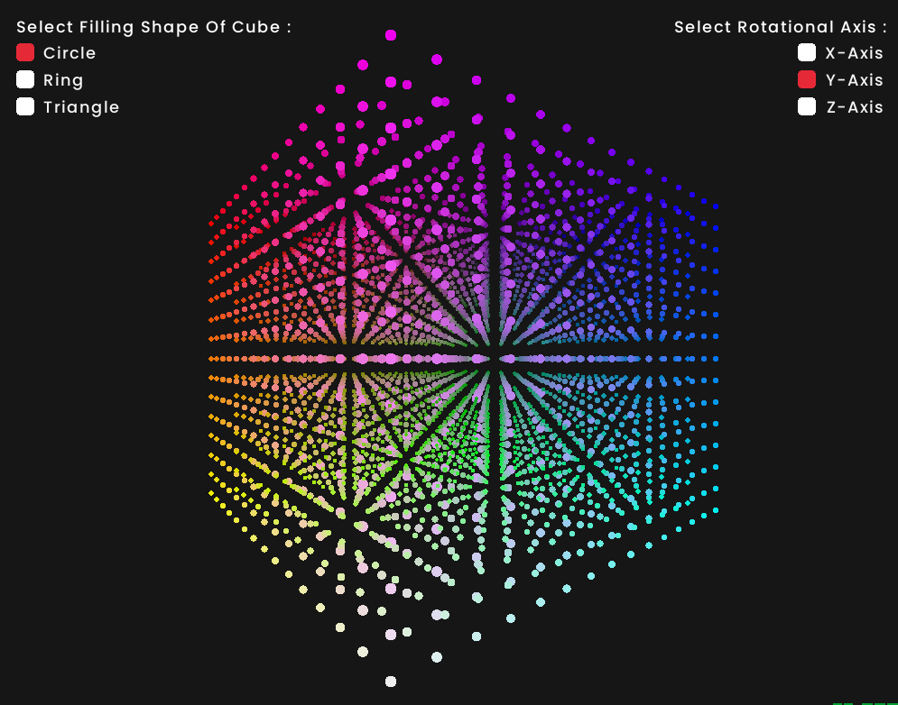

# ROTATING CUBE OF CIRCLES 3D (PROJECTION) IN C++ USING RAYLIB

This project visualizes a 3D rotating cube represented by circles at its vertices, rendered on a 2D plane. The rotation is achieved by projecting the 3D cube's vertices onto a 2D canvas and applying transformations for smooth rotation along all three axes (X, Y, and Z).

- The program demonstrates concepts like:

    - 3D geometry and transformations
    - Projection of 3D points onto 2D space
    - Rotation using trigonometric functions
 
 

## ROTATING CUBE 3D PREVIEW


## DESCRIPTION
- 3D to 2D Projection: Renders a 3D cube on a 2D canvas using simple perspective projection.
- Dynamic Rotation: Rotates the cube along its X, Y, and Z axes simultaneously.
- Customizable Design: Vertices are represented as circles, whose size, color, and spacing can be adjusted.
- Real-Time Animation: Smooth animations give the illusion of continuous rotation.


## SEE CUBE ON WEB
Checkout Game Here: [RotatingCube3d](https://abhikumar45444.github.io/ROTATING-CUBE-3D/).

## (WINDOWS - EXE)
 Run the [RotatingCube3d.exe](./build) file.

## BUILD: If you want to make changes feel free to do so
***
Open Makefile
Make necessary adjustments like Compiler for raylib c++ <code>[raylib github windows setup](https://github.com/raysan5/raylib/wiki/Working-on-Windows)</code>.</br>
You can find raylib library in <code>[library folder](./lib)</code> or else you need to compile the library by yourself.
***

## DEPENDENCIES
```console
raylib
opengl32 
gdi32 
winmm
```

## REFERENCES
[3D Projection](https://en.wikipedia.org/wiki/3D_projection) </br>
[Perspective Projection](https://www.geeksforgeeks.org/perspective-projection-and-its-types/) </br>
[Rotation Matrix](https://en.wikipedia.org/wiki/Rotation_matrix) </br>
